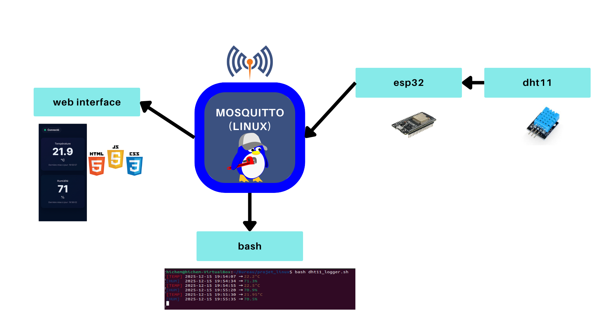
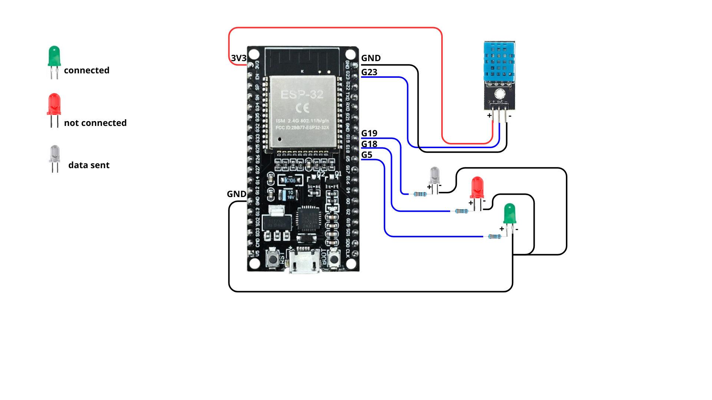
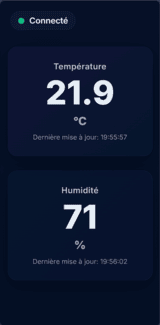

# 🌡️ ESP32 DHT11 – MQTT Temperature & Humidity Monitoring System

## 📖 Overview

This project is an **IoT temperature and humidity monitoring system** built around the **MQTT publish/subscribe protocol**.

It is designed as a **learning-oriented and modular architecture**, suitable for:

* 🎓 **Students** in embedded systems and IoT
* 🔧 **Makers and enthusiasts** exploring MQTT, ESP32, and real-time data visualization

The system is composed of **four independent but interconnected components**:

1. A **Mosquitto MQTT broker** running on Linux
2. An **ESP32 with a DHT11 sensor and status LEDs**
3. A **Web interface** for real-time visualization
4. An optional **Linux logger script** for data storage

---

## 🧱 Global System Architecture




---

## 🐧 Part 1: Linux – Mosquitto MQTT Broker

### 🔹 Role

The MQTT broker acts as the **central communication hub**.
It receives sensor data from the ESP32 and redistributes it to all subscribed clients (web interface, logger script, etc.).

### 🔹 Installation (Ubuntu)

```bash
sudo apt update
sudo apt install mosquitto mosquitto-clients
```

### 🔹 Verification

```bash
mosquitto -v
```

### 🔹 Enable Mosquitto at Startup

```bash
sudo systemctl enable mosquitto
sudo systemctl start mosquitto
```

### 🔹 Enable MQTT over WebSocket

Edit the Mosquitto configuration file:

```bash
sudo nano /etc/mosquitto/mosquitto.conf
```

Add the following lines:

```conf
listener 1883
protocol mqtt

listener 8080
protocol websockets
allow_anonymous true
```

Restart the broker:

```bash
sudo systemctl restart mosquitto
```


---

## 🔌 Part 2: ESP32 + DHT11 Sensor + Status LEDs

### 🔹 Role

The ESP32 is responsible for:

* Reading **temperature and humidity** from the DHT11 sensor
* Publishing sensor data to the MQTT broker every **2 seconds**
* Providing **visual feedback** using status LEDs

### 🔹 MQTT Topics

```text
esp32/dht11/temperature
esp32/dht11/humidity
```

### 🔹 Published Data

* 🌡️ Temperature in **°C**
* 💧 Humidity in **%**

### 🔹 Update Interval

⏱️ Every **2 seconds**

---

### 💡 Status LED Indicators

The ESP32 includes **three LEDs** to provide real-time system status feedback:

| LED Color | GPIO Pin | Function                    |
| --------- | -------- | --------------------------- |
| 🟢 Green  | GPIO 5   | MQTT connection established |
| 🔴 Red    | GPIO 18  | MQTT disconnected           |
| ⚪ White   | GPIO 19  | Data transmission indicator |

These LEDs make the system easier to **debug, monitor, and demonstrate** in educational contexts.

---

### 🔧 Wiring Diagram



---

## 🌐 Part 3: Web Interface (Real-Time Dashboard)

### 🔹 Role

* Subscribes to MQTT topics via **WebSocket**
* Displays temperature and humidity values **in real time**
* Provides clear visual feedback of connection status

### 🔹 Technologies

* HTML / CSS
* JavaScript
* `mqtt.js` library

### 🔹 Features

* 🌙 Modern dark-themed UI
* 🔌 MQTT connection status indicator
* 📊 Live data updates without page refresh



---

## 📜 Part 4: Linux MQTT Logger Script

### 🔹 Role

This script allows data monitoring and persistence on Linux by:

* Subscribing to the same MQTT topics
* Displaying incoming values in the terminal
* Storing measurements in a `.log` file

### 🔹 Usage

```bash
./dht11_logger.sh
```

### 🔹  Output
#### dht11.log :
```text
2025-01-10 14:32:01 | Temperature: 25.3 °C | Humidity: 54 %
2025-01-10 14:32:03 | Temperature: 25.4 °C | Humidity: 55 %
```
#### terminal :


---

## 🎯 Educational Objectives

This project helps learners to:

* Understand **MQTT publish/subscribe communication**
* Design a **distributed IoT system**
* Interface **ESP32 with sensors and LEDs**
* Build a **real-time web dashboard**
* Work with **Linux network services**

---

## 🔮 Possible Enhancements

* MQTT authentication and TLS security
* Database integration (InfluxDB, SQLite)
* Advanced dashboards (Grafana)
* Alert system (threshold-based notifications)
* Support for additional sensors (DHT22, BME280)

---

## 👤 Author

This project was created for **educational, experimental, and demonstration** purposes.

---

## 📄 License

Free.
